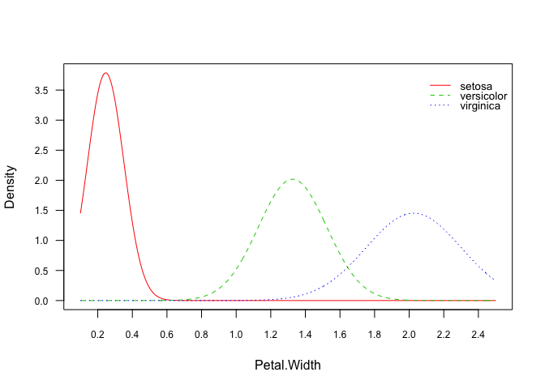
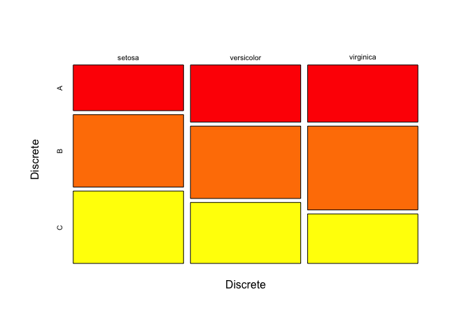
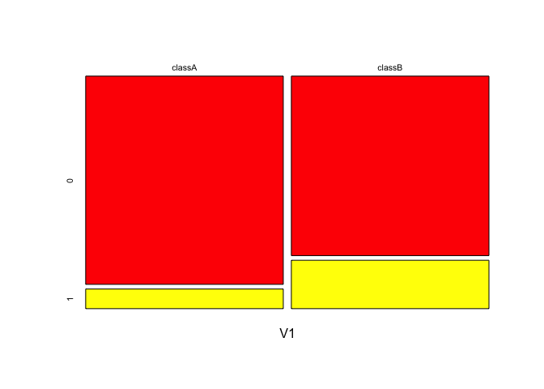
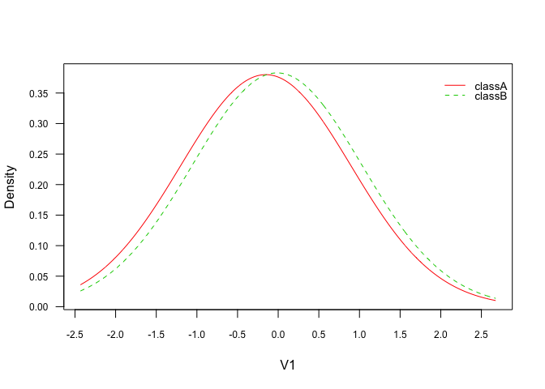

<!-- README.md is generated from README.Rmd. Please edit that file -->

# naivebayes 

[](https://travis-ci.org/majkamichal/naivebayes)
[](https://cran.r-project.org/package=naivebayes)
[](http://cran.rstudio.com/web/packages/naivebayes/index.html)
[](https://saythanks.io/to/majkamichal)

## 1\. Overview

The `naivebayes` package provides an efficient implementation of the
popular Naïve Bayes classifier in `R`. It was developed and is now
maintained based on three principles: it should be efficient, user
friendly and written in `Base R`. The last implies no dependencies,
however, it neither denies nor interferes with being efficient as many
functions from the `Base R` distribution use highly efficient routines
programmed in lower level languages, such as `C` or `FORTRAN`. In fact,
the `naivebayes` package utilizes only such functions for
resource-intensive calculations.

The general function `naive_bayes()` detects the class of each feature
in the dataset and, depending on the user choices, assumes possibly
different distribution for each feature. It currently supports following
class conditional distributions:

  - categorical distribution for discrete features
  - Poisson distribution for non-negative integers
  - Gaussian distribution for continuous features
  - non-parametrically estimated densities via Kernel Density Estimation
    for continuous features

In addition to that specialized functions are available which implement:

  - Bernoulli Naive Bayes via `bernoulli_naive_bayes()`
  - Multinomial Naive Bayes via `multinomial_naive_bayes()`
  - Poisson Naive Bayes via `poisson_naive_bayes()`
  - Gaussian Naive Bayes via `gaussian_naive_bayes()`
  - Non-Parametric Naive Bayes via `nonparametric_naive_bayes()`

They are implemented based on the linear algebra operations which makes
them efficient on the dense matrices. In close future sparse matrices
will be supported in order to boost the performance on the sparse data.
Also few helper functions are provided that are supposed to improve the
user experience. The general `naive_bayes()` function is also available
through the excellent `Caret` package.

Extended documentation can be found on the website:
<https://majkamichal.github.io/naivebayes/>

## 2\. Installation

Just like many other `R` packages, `naivebayes` can be installed from
the `CRAN` repository by simply executing in the console the following
line:

``` r
install.packages("naivebayes")

# Or the the development version from GitHub:
devtools::install_github("majkamichal/naivebayes")
```

## 3\. Usage

The `naivebayes` package provides a user friendly implementation of the
Naïve Bayes algorithm via formula interlace and classical combination of
the matrix/data.frame containing the features and a vector with the
class labels. All functions can recognize missing values, give an
informative warning and more importantly - they can handle them. In
following the basic usage of the `naivebayes` package is demonstrated:

``` r
library(naivebayes)
#> naivebayes 0.9.6 loaded

data(iris)
new <- iris[-c(1,2,3)]
# Add one categorical and count variable
set.seed(1)
new$Discrete <- sample(LETTERS[1:3], nrow(new), TRUE) 
set.seed(1)
new$Counts <- c(rpois(50, 1), rpois(50, 2), rpois(50, 10)) 

# Formula interface
nb <- naive_bayes(Species ~ ., usepoisson = TRUE, data = new)
summary(nb)
#> 
#> ================================ Naive Bayes ================================= 
#>  
#> - Call: naive_bayes.formula(formula = Species ~ ., data = new, usepoisson = TRUE) 
#> - Laplace: 0 
#> - Classes: 3 
#> - Samples: 150 
#> - Features: 3 
#> - Conditional distributions: 
#>     - Categorical: 1
#>     - Poisson: 1
#>     - Gaussian: 1
#> - Prior probabilities: 
#>     - setosa: 0.3333
#>     - versicolor: 0.3333
#>     - virginica: 0.3333
#> 
#> ------------------------------------------------------------------------------


# Or equivalently matrix/data.frame and class vector
df <- new[-2]
class_vec <- new[[2]]
nb2 <- naive_bayes(x = df, y = class_vec, usepoisson = TRUE)
nb2
#> 
#> ================================ Naive Bayes ================================= 
#>  
#>  Call: 
#> naive_bayes.default(x = df, y = class_vec, usepoisson = TRUE)
#> 
#> ------------------------------------------------------------------------------ 
#>  
#> Laplace smoothing: 0
#> 
#> ------------------------------------------------------------------------------ 
#>  
#>  A priori probabilities: 
#> 
#>     setosa versicolor  virginica 
#>  0.3333333  0.3333333  0.3333333 
#> 
#> ------------------------------------------------------------------------------ 
#>  
#>  Tables: 
#> 
#> ------------------------------------------------------------------------------ 
#>  ::: Petal.Width (Gaussian) 
#> ------------------------------------------------------------------------------ 
#>            
#> Petal.Width    setosa versicolor virginica
#>        mean 0.2460000  1.3260000 2.0260000
#>        sd   0.1053856  0.1977527 0.2746501
#> 
#> ------------------------------------------------------------------------------ 
#>  ::: Discrete (Categorical) 
#> ------------------------------------------------------------------------------ 
#>         
#> Discrete setosa versicolor virginica
#>        A   0.24       0.30      0.30
#>        B   0.38       0.38      0.44
#>        C   0.38       0.32      0.26
#> 
#> ------------------------------------------------------------------------------ 
#>  ::: Counts (Poisson) 
#> ------------------------------------------------------------------------------ 
#> 
#>        setosa versicolor virginica
#> lambda   1.08       1.98     10.16
#> 
#> ------------------------------------------------------------------------------

# Visualize class conditional probability distributions
plot(nb, which = c("Petal.Width", "Discrete"),
     arg.cat = list(color = heat.colors(3)))
```

<!-- --><!-- -->

``` r

# Browse tables
tables(nb, which = "Discrete") # <=> nb$tables["Discrete"]
#> 
#> ------------------------------------------------------------------------------ 
#>  ::: Discrete (Categorical) 
#> ------------------------------------------------------------------------------ 
#>         
#> Discrete setosa versicolor virginica
#>        A   0.24       0.30      0.30
#>        B   0.38       0.38      0.44
#>        C   0.38       0.32      0.26
#> 
#> ------------------------------------------------------------------------------

# Get name of conditional distributions for each feature
get_cond_dist(nb) # <=> attr(nb$tables, "cond_dist") 
#>   Petal.Width      Discrete        Counts 
#>    "Gaussian" "Categorical"     "Poisson"

# data.frame("Dist" = get_cond_dist(nb))

# Classification
head(predict(nb))
#> [1] setosa setosa setosa setosa setosa setosa
#> Levels: setosa versicolor virginica

# Posterior probabilities
head(predict(nb, type = "prob"))
#>         setosa   versicolor    virginica
#> [1,] 1.0000000 2.715527e-08 1.515451e-14
#> [2,] 1.0000000 3.982773e-08 1.320599e-13
#> [3,] 1.0000000 3.982773e-08 1.320599e-13
#> [4,] 0.9999999 6.148842e-08 7.341108e-13
#> [5,] 1.0000000 2.715527e-08 1.515451e-14
#> [6,] 0.9999691 3.090011e-05 1.885905e-10
```

### 3.1 Specialized Naive Bayes

#### 3.1.1 Bernoulli Naive Bayes (“bernoulli\_naive\_bayes”)

``` r
### Simulate the data:
set.seed(1)
cols <- 10 ; rows <- 100 ; probs <- c("0" = 0.4, "1" = 0.1)
M <- matrix(sample(0:1, rows * cols,  TRUE, probs), nrow = rows, ncol = cols)
y <- factor(sample(paste0("class", LETTERS[1:2]), rows, TRUE, prob = c(0.3,0.7)))
colnames(M) <- paste0("V", seq_len(ncol(M)))
laplace <- 0.5

### Train the Bernoulli Naive Bayes
bnb <- bernoulli_naive_bayes(x = M, y = y, laplace = laplace)
head(predict(bnb, newdata = M, type = "prob"))
#>         classA    classB
#> [1,] 0.2051196 0.7948804
#> [2,] 0.1598350 0.8401650
#> [3,] 0.2211967 0.7788033
#> [4,] 0.1998863 0.8001137
#> [5,] 0.2346913 0.7653087
#> [6,] 0.1312229 0.8687771


###  Equivalent calculation with general naive_bayes function.
###  (it is made sure that the columns are factors with the 0-1 levels)

df <- as.data.frame(lapply(as.data.frame(M), factor, levels = c(0,1)))
# sapply(df, class)
nb <- naive_bayes(df, y, laplace = laplace)
head(predict(nb, type = "prob"))
#>         classA    classB
#> [1,] 0.2051196 0.7948804
#> [2,] 0.1598350 0.8401650
#> [3,] 0.2211967 0.7788033
#> [4,] 0.1998863 0.8001137
#> [5,] 0.2346913 0.7653087
#> [6,] 0.1312229 0.8687771


# Obtain probability tables
tables(bnb, which = "V1")
#> 
#> ------------------------------------------------------------------------------ 
#>  ::: V1 (Bernoulli) 
#> ------------------------------------------------------------------------------ 
#>      classA    classB
#> 0 0.9137931 0.7876712
#> 1 0.0862069 0.2123288
#> 
#> ------------------------------------------------------------------------------
tables(nb, "V1")
#> 
#> ------------------------------------------------------------------------------ 
#>  ::: V1 (Bernoulli) 
#> ------------------------------------------------------------------------------ 
#>    
#> V1     classA    classB
#>   0 0.9137931 0.7876712
#>   1 0.0862069 0.2123288
#> 
#> ------------------------------------------------------------------------------

# Visualise class conditional Bernoulli distributions
plot(bnb, which = "V1")
```

<!-- -->

``` r
plot(nb, "V1")
```

<!-- -->

``` r

# Check the equivalence of the class conditional distributions
all(get_cond_dist(bnb) == get_cond_dist(nb))
#> [1] TRUE

# # Coerce the Bernoulli probability tables to a data.frame
# bernoulli_tables_to_df(bnb)
```

#### 3.1.1 Gaussian Naive Bayes (“gaussian\_naive\_bayes”)

``` r
### Simulate the data:
cols <- 4 ; rows <- 100 ; probs <- c("0" = 0.4, "1" = 0.1)
M <- matrix(rnorm(rows * cols), nrow = rows, ncol = cols)
y <- factor(sample(paste0("class", LETTERS[1:2]), rows, TRUE))
colnames(M) <- paste0("V", seq_len(ncol(M)))

### Train the Gaussian Naive Bayes
gnb <- gaussian_naive_bayes(x = M, y = y)
head(predict(gnb, newdata = M, type = "prob"))
#>         classA    classB
#> [1,] 0.4858042 0.5141958
#> [2,] 0.4851806 0.5148194
#> [3,] 0.7706261 0.2293739
#> [4,] 0.6513155 0.3486845
#> [5,] 0.4770423 0.5229577
#> [6,] 0.8346050 0.1653950

###  Equivalent calculation with general naive_bayes function.
nb <- naive_bayes(M, y)
head(predict(nb, type = "prob"))
#>         classA    classB
#> [1,] 0.4858042 0.5141958
#> [2,] 0.4851806 0.5148194
#> [3,] 0.7706261 0.2293739
#> [4,] 0.6513155 0.3486845
#> [5,] 0.4770423 0.5229577
#> [6,] 0.8346050 0.1653950

# Obtain probability tables
tables(gnb, which = "V1")
#> 
#> ------------------------------------------------------------------------------ 
#>  ::: V1 (Gaussian) 
#> ------------------------------------------------------------------------------ 
#>         classA      classB
#> mu -0.15263804 -0.01306092
#> sd  1.04955060  1.04174322
#> 
#> ------------------------------------------------------------------------------
tables(nb, "V1")
#> 
#> ------------------------------------------------------------------------------ 
#>  ::: V1 (Gaussian) 
#> ------------------------------------------------------------------------------ 
#>       
#> V1          classA      classB
#>   mean -0.15263804 -0.01306092
#>   sd    1.04955060  1.04174322
#> 
#> ------------------------------------------------------------------------------
coef(gnb)
#>       classA:mu classA:sd   classB:mu classB:sd
#> V1 -0.152638040  1.049551 -0.01306092 1.0417432
#> V2 -0.054836961  1.236748 -0.17010761 0.9824908
#> V3 -0.046420500  1.162157  0.07540914 1.1257598
#> V4  0.007807965  1.015502  0.09767244 0.9543792

# Visualise class conditional Gaussian distributions
plot(gnb, which = "V1")
```

<!-- -->

### 3.2 Usage with Caret package (“naive\_bayes”)

``` r
library(caret, quietly = TRUE)
library(naivebayes)

# Train the Naive Bayes model with the Caret package
naive_bayes_via_caret <- train(Species ~ ., 
                               data = new, 
                               method = "naive_bayes", 
                               usepoisson = TRUE)

naive_bayes_via_caret
#> Naive Bayes 
#> 
#> 150 samples
#>   3 predictor
#>   3 classes: 'setosa', 'versicolor', 'virginica' 
#> 
#> No pre-processing
#> Resampling: Bootstrapped (25 reps) 
#> Summary of sample sizes: 150, 150, 150, 150, 150, 150, ... 
#> Resampling results across tuning parameters:
#> 
#>   usekernel  Accuracy   Kappa    
#>   FALSE      0.9984157  0.9976174
#>    TRUE      0.9891468  0.9835235
#> 
#> Tuning parameter 'laplace' was held constant at a value of 0
#> 
#> Tuning parameter 'adjust' was held constant at a value of 1
#> Accuracy was used to select the optimal model using the largest value.
#> The final values used for the model were laplace = 0, usekernel =
#>  FALSE and adjust = 1.

# Classification
head(predict(naive_bayes_via_caret, newdata = new))
#> [1] setosa setosa setosa setosa setosa setosa
#> Levels: setosa versicolor virginica

# Posterior probabilities
head(predict(naive_bayes_via_caret, newdata = new, type = "prob"))
#>      setosa   versicolor    virginica
#> 1 1.0000000 2.525461e-08 1.216783e-13
#> 2 1.0000000 3.165327e-08 2.590761e-13
#> 3 1.0000000 3.165327e-08 2.590761e-13
#> 4 0.9999999 5.285298e-08 4.820271e-13
#> 5 1.0000000 2.525461e-08 1.216783e-13
#> 6 0.9999734 2.656060e-05 1.238316e-10

## Recover the naive_bayes object
nb_object <- naive_bayes_via_caret$finalModel
class(nb_object)
#> [1] "naive_bayes"
```

Define tuning grid, do resampling and find the “optimal” model:

``` r

# Define tuning grid 
nb_grid <-   expand.grid(usekernel = c(TRUE, FALSE),
                         laplace = c(0, 0.5, 1), 
                         adjust = c(0.75, 1, 1.25, 1.5))
# Fit the Naive Bayes model 
set.seed(2550)
naive_bayes_via_caret2 <- train(Species ~ ., data = new, 
                               method = "naive_bayes",
                               usepoisson = TRUE,
                               tuneGrid = nb_grid)
# Selected tuning parameters
naive_bayes_via_caret2$finalModel$tuneValue
#>   laplace usekernel adjust
#> 1       0     FALSE   0.75

## View the final naive_bayes model
# naive_bayes_via_caret2$finalModel

# Visualize the tuning process
plot(naive_bayes_via_caret2)
```

<!-- -->

``` r

# Perform classification 
head(predict(naive_bayes_via_caret2, newdata = new))
#> [1] setosa setosa setosa setosa setosa setosa
#> Levels: setosa versicolor virginica
```

### 3.3 Usage with nproc package (“naive\_bayes”)

Please find more information about the `nproc` package under:
<https://cran.r-project.org/web/packages/nproc/>

``` r
library(nproc)
library(naivebayes)

# Simulate data
set.seed(2550)
n <- 1000
x <- matrix(rnorm(n * 2), n, 2)
c <- 1 + 3 * x[ ,1]
y <- rbinom(n, 1, 1 / (1 + exp(-c)))
xtest <- matrix(rnorm(n * 2), n, 2)
ctest <- 1 + 3 * xtest[,1]
ytest <- rbinom(n, 1, 1 / (1 + exp(-ctest)))


# Use Naive Bayes classifier and the default type I error control with alpha=0.05
naive_bayes_via_nproc <- npc(x, y, method = "nb")

## Recover the "naive_bayes" object
# naive_bayes_via_nproc$fits[[1]]$fit

# Classification
nb_pred <- predict(naive_bayes_via_nproc, xtest)

# head(nb_pred$pred.label)

# Obtain various measures
accuracy <- mean(nb_pred$pred.label == ytest)
ind0 <- which(ytest == 0)
ind1 <- which(ytest == 1)
typeI <- mean(nb_pred$pred.label[ind0] != ytest[ind0]) #type I error on test set
typeII <- mean(nb_pred$pred.label[ind1] != ytest[ind1]) #type II error on test set

cat(" Overall Accuracy: ",  accuracy,"\n", 
    "Type I error:     ", typeI, "\n",
    "Type II error:    ", typeII, "\n")
#>  Overall Accuracy:  0.68 
#>  Type I error:      0.02072539 
#>  Type II error:     0.5081433
```

### 3.4 Usage with superml package (“naive\_bayes”)

Please find more information about the `superml` package under:
<https://cran.r-project.org/web/packages/superml/>

``` r
library(superml)
#> Loading required package: R6
data(iris)
naive_bayes_via_superml <- NBTrainer$new()
naive_bayes_via_superml$fit(iris, 'Species')

## Recover the naive_bayes object
# naive_bayes_via_superml$model

# Classification
head(naive_bayes_via_superml$predict(iris))
#> Warning: predict.naive_bayes(): More features in the newdata are provided
#> as there are probability tables in the object. Calculation is performed
#> based on features to be found in the tables.
#> [1] setosa setosa setosa setosa setosa setosa
#> Levels: setosa versicolor virginica

# Posterior probabilites
head(naive_bayes_via_superml$predict(iris, type = "prob"))
#> Warning: predict.naive_bayes(): More features in the newdata are provided
#> as there are probability tables in the object. Calculation is performed
#> based on features to be found in the tables.
#>      setosa   versicolor    virginica
#> [1,]      1 2.981309e-18 2.152373e-25
#> [2,]      1 3.169312e-17 6.938030e-25
#> [3,]      1 2.367113e-18 7.240956e-26
#> [4,]      1 3.069606e-17 8.690636e-25
#> [5,]      1 1.017337e-18 8.885794e-26
#> [6,]      1 2.717732e-14 4.344285e-21
```
